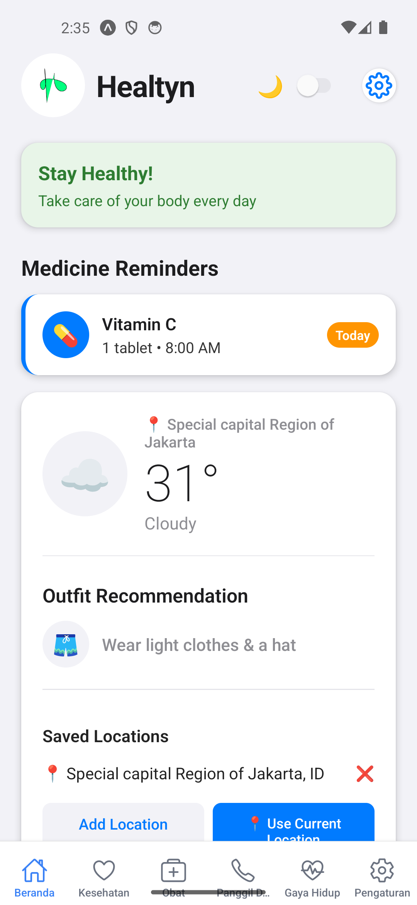
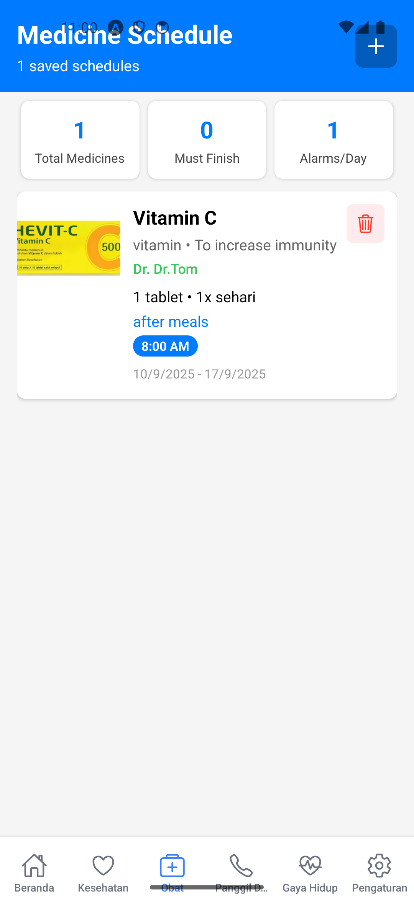
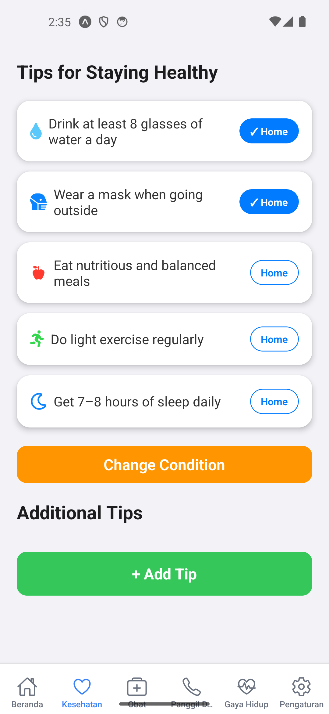
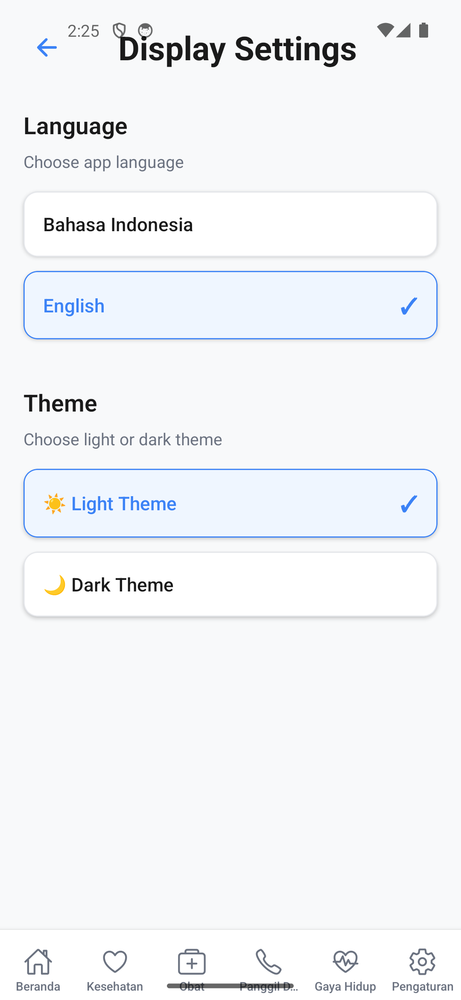
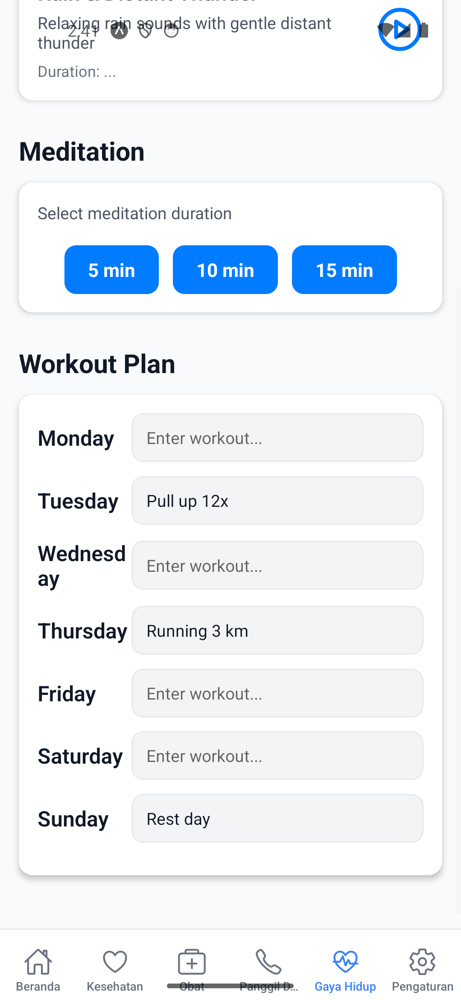

# Healtyn

Healtyn is a Flutter-based mobile health assistant app designed to help users manage daily health activities.  
It provides medicine reminders, BMI checking, lifestyle tracking, family support features, and quick doctor calls especially helpful for elderly users.  

## 📸 Snapshots

  
  
  
  
  
  
  
  
  
  

## ✨ Features

### 1. Dashboard  
- Weather updates with clothing suggestions.  
- Search location for weather forecast.  
- Add reminders and view upcoming medicine schedules.  

### 2. Medicine Reminder  
- Create schedules for prescribed medicines.  
- Notifications with time, medicine name, dosage, photo, and duration.  
- Save history of medicine intake.  
- Record allergies for safety.  

### 3. BMI Checker  
- Input weight, height, and age.  
- Get health recommendations (nutrition tips, weight control).  

### 4. Call Doctor  
- Add frequently contacted doctors.  
- One-tap call for emergency help (especially for elderly users).  

### 5. Family Feature  
- Add family members for quick access.  
- Group chat to share health status and updates in real-time.  

### 6. Meditation Tips  
- Add custom reminders for meditation and wellness.  
- Integrated into dashboard for easy access.  

### 7. Health Check  
- Input health data to monitor current health condition.  
- View summary and progress.  

### 8. Display Settings  
- Switch languages (English / Indonesian).  
- Change app theme (light / dark).  

### 9. Lifestyle Tracker  
- Add workout schedules.  
- Meditation timer with progress tracking.  

## 🚀 About

**Healtyn** is built with **Flutter** to provide a smooth, cross-platform mobile experience.  
This app is part of my personal portfolio project.  
